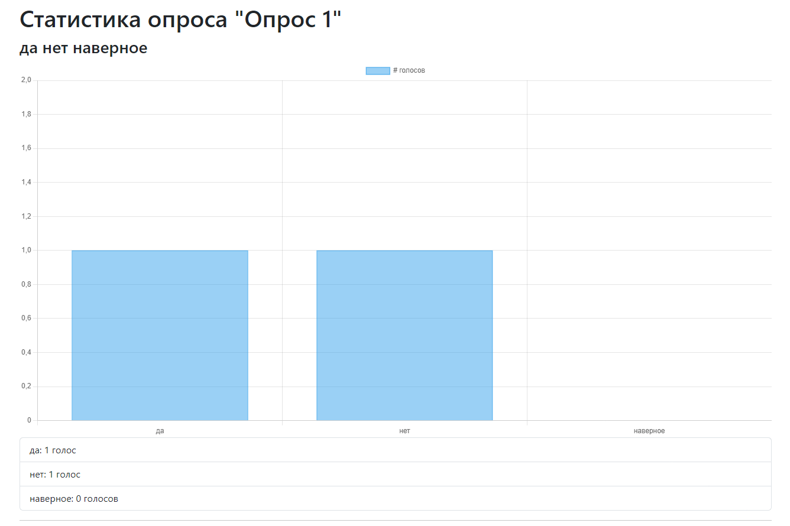

# Пояснительная записка по модификации проекта "Каталог фильмов"

Этот проект реализует модуль опросов пользователей используя фреймворк **Django** на языке **Python**.

## [Модели](https://github.com/JktuJQ/movie_catalog/blob/main/polls/models.py)

Помимо основных моделей фильмов, представленных на следующей фотографии:


были реализованы 3 модели:

* **Poll** - опрос, который может содержать несколько вопросов.

    ```python
    class Poll(MyModel):
        theme = models.CharField("Тема опроса", max_length=1024)
        description = models.TextField("Описание", blank=True, null=True)

        author = models.ForeignKey(User, on_delete=models.CASCADE, verbose_name="Автор опроса")
        film = models.ForeignKey(Film, on_delete=models.CASCADE, verbose_name="Фильм")
    ```

* **Question** - вопрос, который может содержать несколько вариантов ответа.

    ```python
    class Question(MyModel):
        question_types = (
            ("Один вариант ответа", "Один вариант ответа"),
            ("Несколько вариантов ответа", "Несколько вариантов ответа")
        )

        name = models.CharField("Вопрос", max_length=1024)
        question_type = models.CharField("Тип вопроса", max_length=30, choices=question_types, default=question_types[0])

        position = models.PositiveIntegerField("Позиция вопроса")
        poll = models.ForeignKey(Poll, on_delete=models.CASCADE, related_name='questions')
    ```

* **Choice** - вариант ответа, относящийся к вопросу (за вариант ответа может проголосовать много людей).

    ```python
    class Choice(MyModel):
        name = models.CharField(max_length=200, verbose_name="Вариант ответа")
        question = models.ForeignKey(Question, on_delete=models.CASCADE, verbose_name="Вопрос")
        votes = models.ManyToManyField(User, verbose_name="Проголосовавшие", blank=True)

        position = models.PositiveIntegerField("Позиция варианта ответа")
    ```

Полная диаграмма классов проекта выглядит так:


## [Страницы](https://github.com/JktuJQ/movie_catalog/blob/main/polls/urls.py)

В первую очередь была добавлена визуализация опросов в страницах фильмов ([films/film/detail.html](https://github.com/JktuJQ/movie_catalog/blob/main/films/templates/films/film/detail.html)), потом же было добавлено множество [шаблонов](https://github.com/JktuJQ/movie_catalog/tree/main/polls/templates/polls/) и [форм](https://github.com/JktuJQ/movie_catalog/blob/main/polls/forms.py) для создания, изменения и удаления опросов, вопросов и вариантов ответа.

Примечателен просмотр статистики опроса: в [шаблоне](https://github.com/JktuJQ/movie_catalog/blob/main/polls/templates/polls/poll_statistics.html) с использованием **JavaScript** было реализовано построение графиков для улучшенного восприятия.



## Логика приложения

Вся логика приложения, как принято в проектах написанных на **Django**, находится в файле [views.py](https://github.com/JktuJQ/movie_catalog/blob/main/polls/views.py). 

## Запуск проекта

Для запуска этого проекта требуется установить все зависимости из файла [requirements.txt](https://github.com/JktuJQ/movie_catalog/blob/main/requirements.txt) и запустить сервер следующими командами:

```shell
pip install -r requirements.txt  # Установка зависимостей

# Создание БД
python manage.py makemigrations
python manage.py migrate

python manage.py import_films  # Скачивает фильмы в БД используя API Кинопоиска

python manage.py runserver
```

Для того чтобы поэкспериментировать с проектом, можно использовать команды **Django** проекта. Найти такие вы сможете в интернете.
